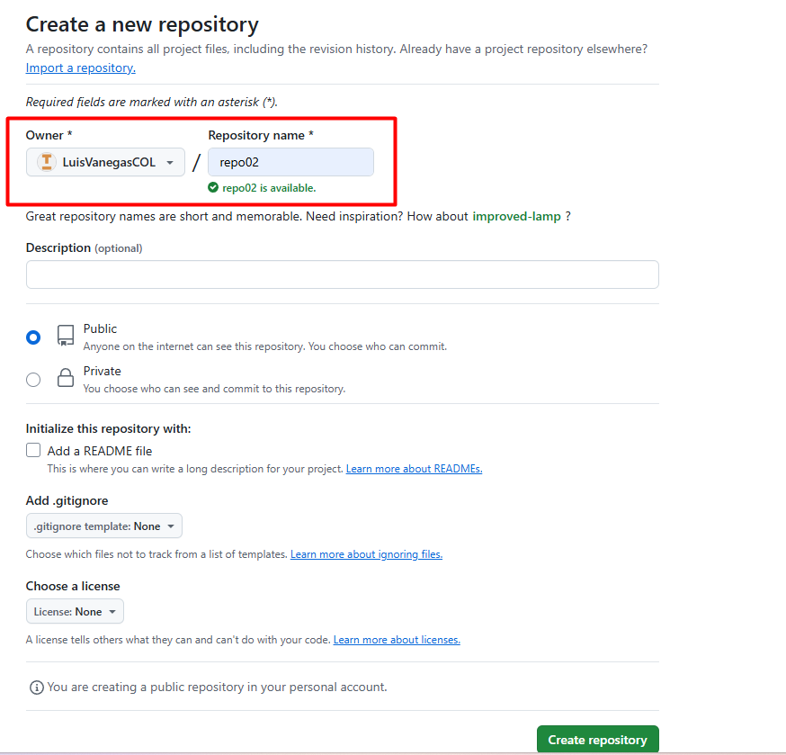
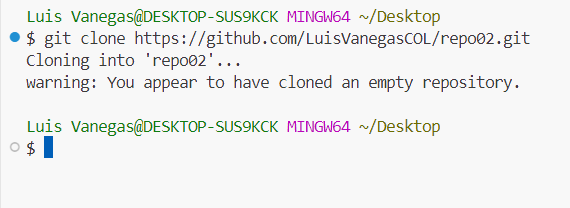
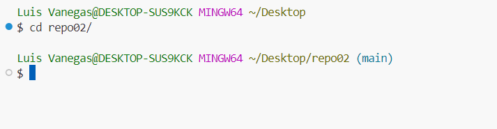
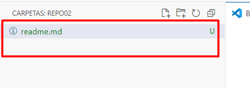
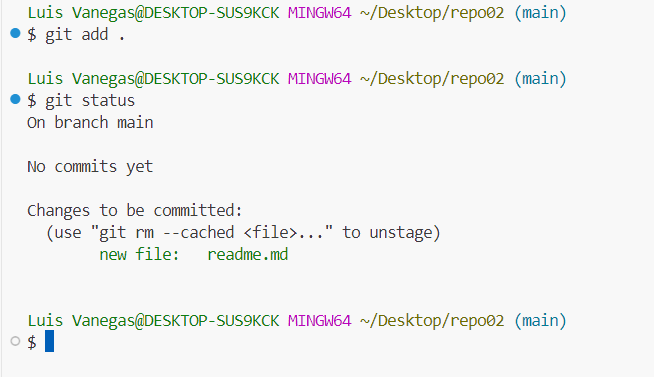
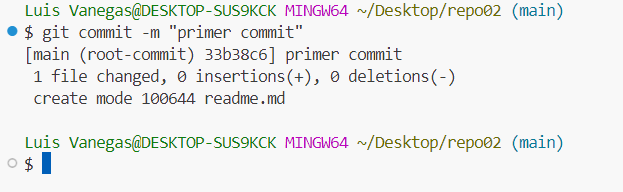

##  **Luis Vanegas**

##  Ejercicio 2.

#### Cree un repositorio desde GITHUB"

#### Abro terminal y desde el escritorio clono el repositorio con GitClone

#### Me muevo hasta el repositorio clonado en mi PC

#### Abro el nuevo repositorio desde VSC y Creo el archivo Readme.md

#### Desde bash puedo mandar el comando add para agregar los archivos que se generaron y el comando git para ver el estado 

#### Teniendo agregado correctamente podemos hacer el primer commit

Con esto ya tendriamos el ejercicio completo correctamente.   Solo queda crear un resumen de los comandos usados 

# Resumen de comandos de Git

## 📌 Comandos básicos de Git

| Comando | Descripción |
|---------|------------|
| `git init` | Inicializa un repositorio Git en la carpeta actual |
| `git clone <url>` | Clona un repositorio remoto en tu máquina |
| `git status` | Muestra el estado de los archivos en el repositorio |
| `git add <archivo>` | Añade archivos al área de preparación (staging) |
| `git commit -m "mensaje"` | Guarda los cambios en el repositorio local |
| `git push origin main` | Envía los cambios al repositorio remoto |
| `git pull origin main` | Descarga y fusiona cambios del repositorio remoto |

# FIN!!!!

>“¡Lo Logramosss!🔥🔥🔥🔥”